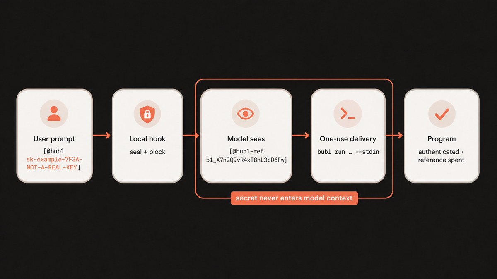

# Bubbl

**One-use API token delivery for Codex.**

When a coding task needs an API token, pasting it directly into the conversation is awkward. Depending on the agent policy, the model may refuse to use it; otherwise the token can remain visible in model context and transcripts. Bubbl replaces an explicitly marked value with an opaque, one-use reference and supplies the original value directly to the program that needs it.



After the hook blocks the marked turn, send an ordinary follow-up such as `continue`. Codex then receives the sanitized pending request containing the opaque reference.

Both examples use a clearly fake API key. They illustrate the intended flow; exact model wording varies.

### Raw API key


The key is now part of the conversation. A safety-aligned agent treats it as exposed, refuses to use it, and asks you to rotate it.

### With Bubbl


Codex receives an opaque reference. The bundled `bubl` executable delivers the value directly to the mock API through stdin, and the reference cannot be reused.

## Delivery

Bubbl does not scan ordinary text or guess what might be secret. Only explicit `[@bubl …]` markers are intercepted. Values are encrypted into the operating system's temporary directory, expire after one hour, and are consumed when the wrapped child process starts successfully. There is no command that reveals a stored value.

`bubl run` prefers stdin:

```text
bubl run TOKEN --stdin -- PROGRAM [ARGS...]
```

For programs that cannot read a token from stdin, Bubbl can set one named environment variable:

```text
bubl run TOKEN --env NAME -- PROGRAM [ARGS...]
```

Environment delivery has a larger exposure surface and should only be used when necessary.

## Install and try it

Install Bubbl from the public [`BubbleBuffer/Bubbl` GitHub releases](https://github.com/BubbleBuffer/Bubbl/releases). The installer downloads the correct Windows, Linux, or macOS package, checks the immutable release and SHA-256 checksum, validates the package metadata, and adds its marketplace to Codex. It does not require a GitHub account or GitHub CLI.

Windows PowerShell:

```powershell
Invoke-WebRequest https://github.com/BubbleBuffer/Bubbl/releases/latest/download/install.ps1 -OutFile install.ps1
.\install.ps1
```

Linux or macOS:

```sh
curl -fL https://github.com/BubbleBuffer/Bubbl/releases/latest/download/install.sh -o install.sh
chmod +x install.sh
./install.sh
```

For full release and artifact-attestation verification, install an authenticated [GitHub CLI](https://cli.github.com/) and run `.\install.ps1 -Strict` or `./install.sh --strict` instead. Both modes still reject bad checksums, unsafe archives, mismatched package metadata, and marketplace collisions before replacing an existing installation.

Pass `-Version 1.0.5` on Windows or `--version 1.0.5` on Linux and macOS to pin an exact stable version. By default, the latest stable release is installed. The marketplace is kept at `%LOCALAPPDATA%\Bubbl\marketplace` on Windows or `${XDG_DATA_HOME:-$HOME/.local/share}/bubbl/marketplace` elsewhere; upgrades are staged and the prior copy is restored if Codex rejects the new plugin. The installer never clones the repository, builds code, or places `bubl` on `PATH`.

After installation, open `/hooks`, inspect and trust the Bubbl `UserPromptSubmit` command, and then start a new task so Codex loads the plugin.

Test the installation only with a disposable canary:

```text
Use this value through stdin: [@bubl sk-example-7F3A-NOT-A-REAL-KEY]
```

A working hook blocks that submission before model sampling. Send an ordinary follow-up such as `continue`; Codex receives the sanitized pending request containing `[@bubl-ref …]`, not the marked value.

Prompt values must be non-empty, single-line UTF-8 without NUL. Inside a marker, `\]` represents `]` and `\\` represents `\`.

## Security reality

> [!IMPORTANT]
> Bubbl is designed to keep the marked value out of the model's working context after its local hook blocks the turn. It has not been verified—and Bubbl does not claim—that the original prompt never reaches OpenAI's servers. The Codex app and hook system see the raw prompt first.

Bubbl reduces accidental disclosure to model context, command arguments, transcripts, and ordinary logs. It is not a password manager, sandbox, operating-system keychain, or defense against a malicious same-user process. The program receiving a bubble can disclose its input, and an opaque reference is itself a bearer capability until it is consumed or expires.

See [SECURITY.md](SECURITY.md) for the complete boundary and vulnerability-reporting guidance.

## Development

Rust 1.85 or newer is required.

```text
cargo fmt --all -- --check
cargo test --locked --all-targets --all-features
cargo clippy --locked --all-targets --all-features -- -D warnings
```

Local source builds are for contributors, not an installation channel. Published installers accept only immutable releases from the official repository. Strict mode additionally verifies their GitHub attestations. Every archive includes `BUILD-INFO.json`, the complete plugin, and its local Codex marketplace declaration.

See [CHANGELOG.md](CHANGELOG.md) for release notes and [RELEASING.md](RELEASING.md) for the release checklist.

Licensed under the MIT License.
